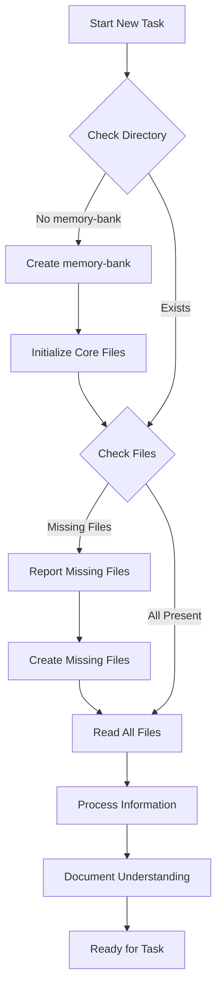

# Global Memory Bank Initialization Task

This task MUST be executed at the start of EVERY new task across ALL projects to ensure continuity and context preservation.

## Required Steps

### 1. Check for Memory Bank
- Verify existence of memory-bank directory in project root
- If missing, create memory-bank directory and core files
- Core files required:
  - projectbrief.md
  - productContext.md
  - systemPatterns.md
  - techContext.md
  - activeContext.md
  - progress.md

### 2. Read All Files
1. Read projectbrief.md first - this is the foundation
2. Read remaining core files in this order:
   - productContext.md
   - systemPatterns.md
   - techContext.md
   - activeContext.md
   - progress.md

### 3. Document Current Understanding
After reading all files:
1. Summarize key insights
2. Note any patterns identified
3. Acknowledge current project state
4. Identify next steps from activeContext.md

## File Reading Process



## Core Files Template Structure

### projectbrief.md
```markdown
# Project Brief

## Overview
[Project description]

## Goals
- [Goal 1]
- [Goal 2]

## Requirements
- [Requirement 1]
- [Requirement 2]

## Scope
[Project scope details]
```

### productContext.md
```markdown
# Product Context

## Purpose
[Why this project exists]

## Problems Solved
- [Problem 1]
- [Problem 2]

## User Experience Goals
- [UX Goal 1]
- [UX Goal 2]
```

### systemPatterns.md
```markdown
# System Patterns

## Architecture
[System architecture details]

## Design Patterns
- [Pattern 1]
- [Pattern 2]

## Component Relationships
[Component interaction details]
```

### techContext.md
```markdown
# Technical Context

## Technologies
- [Technology 1]
- [Technology 2]

## Development Setup
[Setup instructions]

## Dependencies
[Key dependencies]
```

### activeContext.md
```markdown
# Active Context

## Current Focus
[Current work description]

## Recent Changes
- [Change 1]
- [Change 2]

## Next Steps
- [Step 1]
- [Step 2]
```

### progress.md
```markdown
# Progress

## Completed
- [Completed item 1]
- [Completed item 2]

## In Progress
- [Current item 1]
- [Current item 2]

## Upcoming
- [Planned item 1]
- [Planned item 2]

## Known Issues
- [Issue 1]
- [Issue 2]
```

## Understanding Verification

Before proceeding with any task:
1. Verify understanding of:
   - Project goals and requirements
   - Current system state
   - Technical constraints
   - Active work and priorities
   - Next planned steps

2. Confirm grasp of:
   - System architecture
   - Design patterns
   - Implementation approaches
   - Project evolution

## Documentation Requirements

When documenting understanding:
1. Be explicit about comprehension
2. Note any unclear areas
3. Identify potential conflicts
4. Surface any concerns

## Success Criteria

✓ Memory bank directory exists
✓ All core files present
✓ Core files read and understood
✓ Current project state grasped
✓ Active work context internalized
✓ Next steps identified
✓ Technical boundaries understood
✓ System patterns recognized

---

IMPORTANT NOTES:
1. This initialization is NOT optional
2. MUST be performed at the start of EVERY task
3. Core files should be created if missing
4. Templates above should be used for new files
5. All projects MUST maintain memory bank structure
